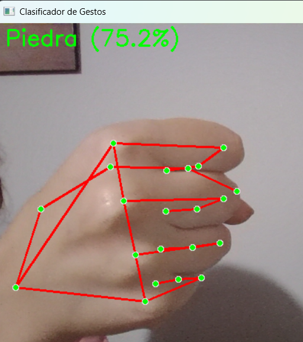

# Sistema de Clasificación de Gestos: Piedra, Papel o Tijeras

Sistema de visión por computadora que detecta y clasifica gestos de mano en tiempo real usando MediaPipe y redes neuronales.

<div align="center">
  
</div>

## Características Principales
- 🖐️ Detección de landmarks de mano con MediaPipe
- 🧠 Modelo de red neuronal para clasificación de gestos
- 🎥 Funcionamiento en tiempo real con cámara web
- 📊 Entrenamiento personalizable con dataset propio

## Requisitos del Sistema
- Python 3.8+
- Webcam funcional
- 1GB+ de espacio libre

## Instalación
```bash
git clone https://github.com/JuliaSumiacher/AA2-SUMIACHER-CIMA-LONGO
cd Ej2-rock-paper-scissors-classifier
pip install -r requirements.txt
```

## Modo de Uso

### 1. Grabar Dataset
```bash
python record-dataset.py
```
- Presiona 0, 1, 2 para grabar piedra, papel o tijeras respectivamente
- Presiona 'q' para salir
- Los datos se guardan en `rps_dataset.npy` y `rps_labels.npy`
- Se denota con un guión bajo y un numero, el numero de datos por clase que
tiene el dataset. Por ejemplo, `rps_dataset_300.npy` tiene 300 ejemplos para
cada clase.

### 2. Entrenar Modelo
```bash
python train-gesture-classifier.py
```
- Entrena con el dataset grabado
- El modelo se guarda como `rps_model.keras`
- El scaler utilizado se guarda como `rps_scaler.pkl`

### 3. Ejecutar Clasificador
```bash
python rock-paper-scissors.py
```
- Muestra la clasificación en tiempo real. Si la confianza de la clasificación es menor al 60%,
se muestra un mensaje de "No se detectó un gesto".
- Presiona 'q' para salir


## Dependencias Principales
- OpenCV: Procesamiento de imágenes
- MediaPipe: Detección de landmarks
- TensorFlow: Red neuronal
- NumPy: Manejo de datos

## Dataset y Entrenamiento
Se recomienda: 
- Grabar muchas muestras por clase
- Variar posición, iluminación y tamaño de mano
- El modelo base usa:
  - 42 características de entrada (21 landmarks × [x,y])
  - 3 neuronas de salida (clases)


## Contribuir
1. Haz fork del proyecto
2. Crea tu branch (`git checkout -b feature/nueva-funcionalidad`)
3. Commit cambios (`git commit -m 'Add nueva funcionalidad'`)
4. Push al branch (`git push origin feature/nueva-funcionalidad`)
5. Abre Pull Request


## Recursos Adicionales
- [Documentación MediaPipe](https://ai.google.dev/edge/mediapipe/solutions/vision/hand_landmarker)
- [Modelo preentrenado Hand Landmarker](https://developers.google.com/mediapipe/solutions/vision/hand_landmarker#models)

---

**Nota:** Descargar el archivo `hand_landmarker.task` desde [el repositorio oficial de MediaPipe](https://ai.google.dev/edge/mediapipe/solutions/vision/hand_landmarker#models) y colocarlo en el directorio raíz del proyecto.

- ¿Qué es `hand_landmarker.task`?

    Es un modelo preentrenado que contiene:
    - La arquitectura de la red neuronal.

    - Los pesos entrenados para detectar landmarks (puntos clave) de manos.

    - Configuraciones específicas para el procesamiento de imágenes.


```